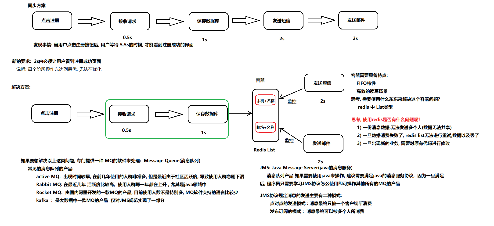
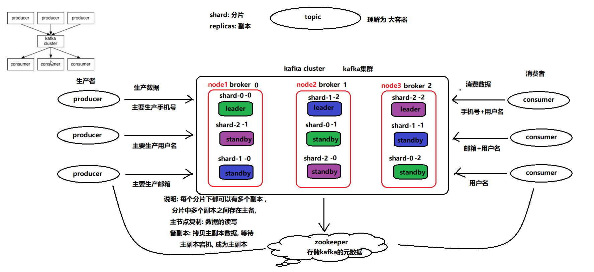
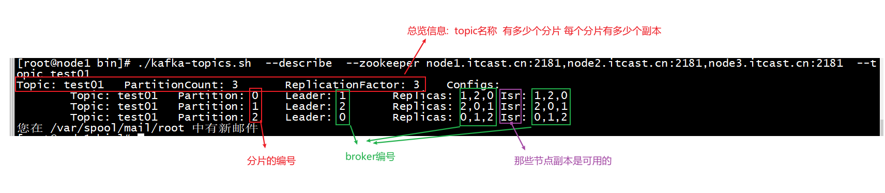
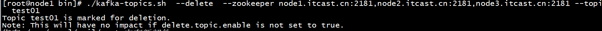
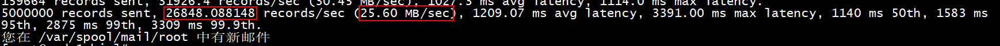
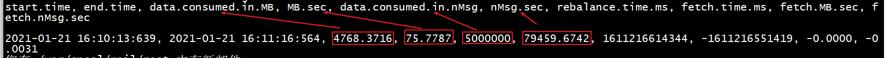

<!--
 * @Author: Alan
 * @Date: 2022-03-12 15:40:42
 * @LastEditTime: 2022-03-12 15:47:23
 * @LastEditors: Alan
 * @Description: 
 * 
-->

## 1. 消息队列的基本介绍

* 消息:  数据, 只不过这个数据出现流动状态
* 队列:  容器 只不过这个容器具有FIFO特性

消息队列: 指的是数据存储在队列中, 从队列的一端流向对队列的另一端过程



消息队列的应用场景:

* 1) 同步转异步操作
* 2) 应用解耦合
* 3) 限流削峰
* 4) 消息驱动系统


## 2. kafka的基本介绍

​	kafka是大数据中一款消息队列的中间件产品, 最早是有领英开发的, 后期将其贡献给了apache 成为apache的顶级项目

​	kafka是采用Scala语言编写 kafka并不是对JMS规范完整实现 仅实现一部分 , kafka集群依赖于zookeeper

​	kafka可以对接离线业务或者实时业务,  可以很好的和apache其他的软件进行集成, 可以做流式数据分析(实时分析)

kafka的特点:

* 1) 高可靠性 : 数据不容易丢失, 数据分布式存储, 集群某个节点宕机也不会影响
* 2) 高可扩展性 :  动态的进行添加或者减少集群的节点
* 3) 高耐用性 :  数据持久化的磁盘上
* 4) 高性能 :  数据具有高吞吐量
* 5) 非常快:  零停机 和  零数据丢失 (存在重复消费问题)

## 3. kafka的架构



```
专业术语:
    kafka cluster:  kafka的集群
    broker:  kafka集群中各个节点
    producer:  生产者
    consumer: 消费者
    topic:  主题 话题    类似于大的容器
    shard: 分片  类似于将大的容器切分为多个小的容器
    	分片数量是否受限于集群节点数量呢?  不会的
    replicas: 副本  对每个分片构建多个副本, 保证数据不丢失
    	副本数量是否会受限于集群节点的数据呢?  是  最多和节点是一致的
```

## 4. kafka的安装操作

```shell
启动kafka集群: 
	cd /export/server/kafka_2.12-2.4.1/bin
	./kafka-server-start.sh ../config/server.properties
一键化启动脚本: 
	1) 在node1节点上创建 /export/onekey
	    mkdir -p /export/onekey
	2) 将资料中 <<kafka一键化启动脚本>> 目录中三个文件拷贝到 /export/onekey目录下
	3) 赋权限
		cd /export/onekey
		chmod 755 *
```

## 5. kafka的shell命令的操作

* 1) 创建topic:

```shell
./kafka-topics.sh  --create  --zookeeper node1.itcast.cn:2181,node2.itcast.cn:2181,node3.itcast.cn:2181  --topic test01 --partitions 3  --replication-factor 3
```

* 2) 查看所有的topic:

```shell
./kafka-topics.sh  --list  --zookeeper node1.itcast.cn:2181,node2.itcast.cn:2181,node3.itcast.cn:2181
```

* 3) 查看某一个topic的详细信息

```shell
./kafka-topics.sh  --describe  --zookeeper node1.itcast.cn:2181,node2.itcast.cn:2181,node3.itcast.cn:2181  --topic test01
```



* 4) 如何删除一个topic

```shell
./kafka-topics.sh  --delete  --zookeeper node1.itcast.cn:2181,node2.itcast.cn:2181,node3.itcast.cn:2181 --topic test01
```



```
说明:
	在kafka中默认情况下删除topic, 仅仅是标记删除, topic中数据其实并没有直接从磁盘中被删除
	原因: kafka担心将数据给删除, 仅仅是标记
如果想要永久删除: 需要在server.properties中配置
	delete.topic.enable=true
```

* 5) 模拟 如何通过生产者生产数据:

```shell
./kafka-console-producer.sh  --broker-list  node1.itcast.cn:9092,node2.itcast.cn:9092,node3.itcast.cn:9092 --topic test02
```

* 6) 模拟 如何通过消费者来消费数据:

```shell
./kafka-console-consumer.sh  --bootstrap-server node1.itcast.cn:9092,node2.itcast.cn:9092,node3.itcast.cn:9092 --topicpic test02
```

* 7) 增加topic的分片数量

```shell
./kafka-topics.sh  --alter --zookeeper node1.itcast.cn:2181,node2.itcast.cn:2181,node3.itcast.cn:2181 --topic test02 --partitions 5
```

​	说明: 可以变大或者变小分片的数量, 但是不允许修改副本的数量

## 6. kafka的基准测试

* 1)  创建一个测试topic:  1个分片 1个副本

```shell
./kafka-topics.sh  --zookeeper node1.itcast.cn:2181,node2.itcast.cn:2181,node3.itcast.cn:2181 --create --topic benchmark  --partitions 1 --replication-factor 1
```

* 2) 测试生产者写入的效率:

```shell
./kafka-producer-perf-test.sh  --topic benchmark --num-records 5000000 --throughput -1 --record-size 1000 --producer-props bootstrap.servers=node1.itcast.cn:9092,node2.itcast.cn:9092,node3.itcast.cn:9092 acks=1
```



* 3) 测试消费者消费的效率

```shell
./kafka-consumer-perf-test.sh --broker-list node1.itcast.cn:9092,node2.itcast.cn:9092,node3.itcast.cn:9092 --topic benchmark --fetch-size 1048576 --messages 5000000
```




## 7.  kafka的 java API的操作

### 7.1 如何使用java API 将数据生产到 kafka

需求: 使用java程序 向kafka写入 1~100 的数字

* 1) 创建项目, 导入相关的依赖

```xml
<dependencies>
        <dependency>
            <groupId>org.apache.kafka</groupId>
            <artifactId>kafka-clients</artifactId>
            <version>2.4.1</version>
        </dependency>

        <dependency>
            <groupId>commons-io</groupId>
            <artifactId>commons-io</artifactId>
            <version>1.3.2</version>
        </dependency>


        <dependency>
            <groupId>org.slf4j</groupId>
            <artifactId>slf4j-log4j12</artifactId>
            <version>1.7.6</version>
        </dependency>

        <dependency>
            <groupId>log4j</groupId>
            <artifactId>log4j</artifactId>
            <version>1.2.16</version>
        </dependency>
    </dependencies>

    <build>
        <plugins>
            <plugin>
                <groupId>org.apache.maven.plugins</groupId>
                <artifactId>maven-compiler-plugin</artifactId>
                <version>3.1</version>
                <configuration>
                    <target>1.8</target>
                    <source>1.8</source>
                </configuration>
            </plugin>
        </plugins>
    </build>
```

* 2) 创建包结构: 
* 3) 编写生产者代码:

```java
public class KafkaProducerTest  {


    public static void main(String[] args) {

        //1.1: 配置生产者相关信息
        Properties props = new Properties();
        props.put("bootstrap.servers", "node1.itcast.cn:9092,node2.itcast.cn:9092,node3.itcast.cn:9092"); // 指定kafka服务地址
        props.put("acks", "all"); // 校验机制  主要目的是为了保证消息不丢失
        props.put("key.serializer", "org.apache.kafka.common.serialization.StringSerializer"); // 指定 key的序列化类型
        props.put("value.serializer", "org.apache.kafka.common.serialization.StringSerializer"); // 指定 value的序列化类型

        //1. 创建kafkaProducer 生产者核心类对象:  指定生产者配置信息
        Producer<String, String> producer = new KafkaProducer<>(props);
        for (int i = 1; i <= 100; i++) {
            //2. 发送数据操作
            // ProducerRecord : 生产者数据传递的承载类
            ProducerRecord<String, String> producerRecord = new ProducerRecord<>("test02",  Integer.toString(i));
            producer.send(producerRecord);
        }
        //3. 释放资源
        producer.close();

    }
}
```

### 7.2 如何使用javaAPI 消费kafka中数据

* 代码演示 : 自动提交

```java

public class KafkaConsumerTest {

    public static void main(String[] args) {
        //1.1: 指定kafka消费者的配置信息
        Properties props = new Properties();
        props.setProperty("bootstrap.servers", "node1.itcast.cn:9092,node2.itcast.cn:9092,node3.itcast.cn:9092"); // kafka的连接地址
        props.setProperty("group.id", "test"); // 消费组 ID
        props.setProperty("enable.auto.commit", "true"); // 是否启动自动提交消者偏移量
        props.setProperty("auto.commit.interval.ms", "1000"); //  每间隔多长时间提交一次偏移量信息
        props.setProperty("key.deserializer", "org.apache.kafka.common.serialization.StringDeserializer"); // 指定反序列化的key类型
        props.setProperty("value.deserializer", "org.apache.kafka.common.serialization.StringDeserializer");// 指定反序列化的value类型


        //1. 创建 kafka的消费者核心类对象 KafkaConsumer , 并指定其消费者配置信息
        KafkaConsumer<String, String> consumer = new KafkaConsumer<>(props);

        //2. 指定消费者要监听那些topic
        consumer.subscribe(Arrays.asList("test02"));
        while (true) {
            //3. 获取数据:
            ConsumerRecords<String, String> records = consumer.poll(Duration.ofMillis(100));

            for (ConsumerRecord<String, String> record : records) {
                //System.out.printf("offset = %d, key = %s, value = %s%n", record.offset(), record.key(), record.value());
                System.out.println("从哪个分片中获取数据: "+record.partition() +";获取数据: "+record.value());
            }
        }

    }
}
```


* 手动提交偏移量信息: 

```java
// 编写手动提交偏移量代码
public class KafkaConsumerTest02 {

    public static void main(String[] args) {

        //1.1: 指定kafka消费者的配置信息
        Properties props = new Properties();
        props.setProperty("bootstrap.servers", "node1.itcast.cn:9092,node2.itcast.cn:9092,node3.itcast.cn:9092"); // kafka的连接地址
        props.setProperty("group.id", "test"); // 消费组 ID
        props.setProperty("enable.auto.commit", "false"); // 是否启动自动提交消者偏移量
        //props.setProperty("auto.commit.interval.ms", "1000"); //  每间隔多长时间提交一次偏移量信息
        props.setProperty("key.deserializer", "org.apache.kafka.common.serialization.StringDeserializer"); // 指定反序列化的key类型
        props.setProperty("value.deserializer", "org.apache.kafka.common.serialization.StringDeserializer");// 指定反序列化的value类型
        
        
        //1. 创建消费者核心对象
        KafkaConsumer<String,String> kafkaConsumer = new KafkaConsumer<String, String>(props);
        
        //2. 指定消费者监控的topic
        kafkaConsumer.subscribe(Arrays.asList("test02"));
        
        //3. 读取数据
        while( true ){

            ConsumerRecords<String, String> consumerRecords = kafkaConsumer.poll(Duration.ofMillis(1000));
            for (ConsumerRecord<String, String> consumerRecord : consumerRecords) {

                String value = consumerRecord.value(); // 获取到数据
                
                // 4. 处理相关的业务  : 例如发短信
                System.out.println("正在发送短信:"+value);
                
                //5. 提交消费的偏移量, 告知以及消费完成了
                kafkaConsumer.commitAsync(); // 手动提交偏移量信息


            }
        }
    }
}
```

### 7.3 异步发送数据, 带有回调函数操作:

```java
public class KafkaProducerTest02 {

    public static void main(String[] args) {
        //1.1 创建生产者的配置信息:
        Properties prop = new Properties();
        prop.put("bootstrap.servers", "node1.itcast.cn:9092,node2.itcast.cn:9092,node3.itcast.cn:9092"); // 指定kafka服务地址
        prop.put("acks", "all"); // 校验机制  主要目的是为了保证消息不丢失
        prop.put("key.serializer", "org.apache.kafka.common.serialization.StringSerializer"); // 指定 key的序列化类型
        prop.put("value.serializer", "org.apache.kafka.common.serialization.StringSerializer"); // 指定 value的序列化类型


        //1.创建生产者的核心对象
        KafkaProducer<String,String> kafkaProducer = new KafkaProducer<String, String>(prop);

        //2. 执行发送数据操作
        ProducerRecord<String, String> producerRecord = new ProducerRecord<String, String>("test02","你好吗? ");
        kafkaProducer.send(producerRecord, new Callback() {
            @Override
            public void onCompletion(RecordMetadata metadata, Exception exception) {
                if(exception !=null){ // 表示数据发生失败了
                    System.out.println("数据发生失败了...");
                    exception.printStackTrace();
                }else { // 表示数据发生成功了
                    System.out.println("恭喜, 发生成功了....");
                }
            }
        });

        //3. 释放资源
        kafkaProducer.close();


    }
}
```